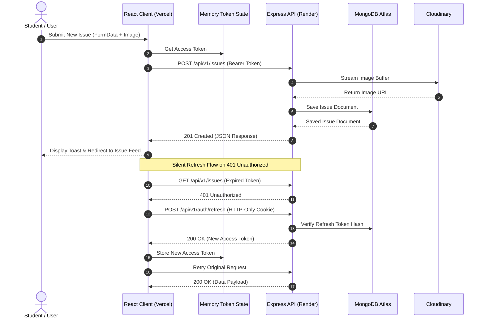

# CampusFix 🛠️

> **A clean, calm, and reliable campus maintenance reporting and issue-tracking web application.**

---

## 📌 Problem Statement

In many educational institutions and hostel complexes, infrastructure issues—such as faulty Wi-Fi routers, plumbing leaks, broken furniture, or electrical outages—are reported through informal channels, messy WhatsApp groups, or paper registers. This leads to untracked requests, lack of transparency, repeated duplicate complaints, and delayed resolutions. 

**CampusFix** solves this by providing a centralized digital portal where students can quickly submit geotagged maintenance reports with photos, track status updates in real-time, and upvote existing issues to highlight urgent problems to campus staff and administration.

---

## 🖼️ UI Screenshots & Previews

| Issue Feed & Filters | Report New Issue |
| :---: | :---: |
|  |  |

| Issue Details & Comments | Staff Management Dashboard |
| :---: | :---: |
|  |  |

---

## 🛠️ Tech Stack & Justification

### Frontend
- **React 18**: Provides a responsive, declarative UI with fine-grained component state management.
- **Vite 5**: Ensures lightning-fast HMR during development and optimized production bundling.
- **TailwindCSS 3**: Enables custom, restrained design styling without heavy CSS bundle overhead.
- **React Hook Form & Zod**: Delivers type-safe form validations and instant inline error feedback.
- **Axios**: Provides clean HTTP client abstraction with interceptors for silent JWT token refreshes.
- **Lucide React**: Provides accessible, lightweight iconography.

### Backend
- **Node.js & Express**: Provides a lightweight, non-blocking asynchronous REST API backend.
- **MongoDB & Mongoose**: Fits hierarchical issue structures, comment subdocuments, and embedded upvote arrays naturally.
- **JSON Web Tokens (JWT)**: Enables stateless, secure authentication via short-lived access tokens and refresh tokens.
- **Cloudinary**: Offloads user image uploads safely to external cloud storage with memory buffer streaming.
- **Helmet & Express Rate Limit**: Protects application endpoints against common web vulnerabilities and brute-force DoS attacks.

---

## 📐 Architecture Diagram



---

## 📁 Directory Folder Structure

```text
CampusFix/
├── client/                     # Frontend React SPA
│   ├── public/                 # Static public assets
│   ├── src/
│   │   ├── api/                # Axios instance & interceptors (client.js)
│   │   ├── components/         # UI components & layout elements
│   │   │   ├── layout/         # Navbar, Footer, Main Layout
│   │   │   ├── routes/         # ProtectedRoute, RoleRoute
│   │   │   └── ui/             # Badge, StatusPill, SkeletonCard, EmptyState, Pagination
│   │   ├── context/            # AuthContext, ToastContext
│   │   ├── hooks/              # useDebounce, custom utility hooks
│   │   ├── pages/              # Feed, IssueDetail, CreateIssue, MyReports, Dashboard, Auth
│   │   ├── utils/              # Time formatters, status helpers
│   │   ├── App.jsx             # React Router route registry
│   │   ├── main.jsx            # Entry point
│   │   └── index.css           # Tailwind directives & theme styles
│   ├── index.html
│   ├── package.json
│   ├── tailwind.config.js
│   └── vite.config.js
│
├── server/                     # Backend Node.js Express API
│   ├── src/
│   │   ├── config/             # DB connection, env schemas, Cloudinary configuration
│   │   ├── controllers/        # Request handlers (auth, issue, comment)
│   │   ├── middleware/         # Auth verification, RBAC, Multer upload, Zod validation
│   │   ├── models/             # Mongoose schemas (User, Issue, Comment)
│   │   ├── routes/             # Express API route endpoints
│   │   ├── services/           # Business logic & DB queries
│   │   ├── utils/              # ApiError, ApiResponse, asyncHandler helpers
│   │   ├── validators/         # Zod schemas for request validation
│   │   ├── app.js              # Express app middleware assembly
│   │   └── server.js           # Server bootstrap & process handlers
│   └── package.json
│
├── README.md
├── ARCHITECTURE.md
└── .gitignore
```

---

## ⚡ Local Setup & Installation

### Prerequisites
- **Node.js**: v18.0.0 or higher
- **MongoDB**: Local MongoDB instance or MongoDB Atlas URI
- **Cloudinary Account**: Free tier Cloudinary credentials for image uploads

### 1. Clone Repository
```bash
git clone https://github.com/vishnugpai007/CampusFix.git
cd CampusFix
```

### 2. Configure Backend Server
```bash
cd server
npm install
cp .env.example .env
```
*Edit `server/.env` with your MongoDB URI, JWT secrets, and Cloudinary keys.*

Start backend in development mode:
```bash
npm run dev
```
Backend will run at `http://localhost:5000/api/v1`.

### 3. Configure Frontend Client
In a new terminal window:
```bash
cd client
npm install
cp .env.example .env
```
*Ensure `VITE_API_URL` points to `http://localhost:5000/api/v1`.*

Start frontend development server:
```bash
npm run dev
```
Open `http://localhost:5173` in your browser.

---

## 🔐 Full Environment Variables Reference

### Backend (`server/.env`)

| Variable Name | Required | Default Value | Description |
| :--- | :---: | :--- | :--- |
| `PORT` | No | `5000` | Port for Express server |
| `NODE_ENV` | Yes | `development` | Environment mode (`development` or `production`) |
| `CORS_ORIGIN` | Yes | `http://localhost:5173` | Allowed frontend origin URL for CORS |
| `MONGO_URI` | Yes | - | MongoDB connection string |
| `JWT_ACCESS_SECRET` | Yes | - | Secret string for short-lived Access Tokens |
| `JWT_REFRESH_SECRET` | Yes | - | Secret string for long-lived Refresh Tokens |
| `CLOUDINARY_CLOUD_NAME` | Yes | - | Cloudinary cloud account name |
| `CLOUDINARY_API_KEY` | Yes | - | Cloudinary API Key |
| `CLOUDINARY_API_SECRET` | Yes | - | Cloudinary API Secret |

### Frontend (`client/.env`)

| Variable Name | Required | Default Value | Description |
| :--- | :---: | :--- | :--- |
| `VITE_API_URL` | Yes | `http://localhost:5000/api/v1` | Base API URL for backend HTTP requests |

---

## 🌐 Complete API Reference Table

### Authentication (`/api/v1/auth`)
| Method | Endpoint | Auth Required | Description |
| :--- | :--- | :---: | :--- |
| `POST` | `/register` | No | Register new user account (`name`, `email`, `password`, `hostelBlock`) |
| `POST` | `/login` | No | Authenticate user, return in-memory token & set HTTP-only cookie |
| `POST` | `/refresh` | No | Silent refresh endpoint to issue new access token using refresh cookie |
| `POST` | `/logout` | Yes | Revoke refresh token in database and clear HTTP-only cookie |
| `GET` | `/me` | Yes | Retrieve current logged-in user profile |

### Issues (`/api/v1/issues`)
| Method | Endpoint | Auth Required | Roles Allowed | Description |
| :--- | :--- | :---: | :---: | :--- |
| `GET` | `/` | Yes | All | Search, filter, sort & paginate campus issues |
| `POST` | `/` | Yes | All | Report new issue with optional photo upload |
| `GET` | `/stats/summary` | Yes | `staff`, `admin` | Aggregated resolution stats & breakdown counts |
| `GET` | `/:id` | Yes | All | Retrieve complete issue details and reporter info |
| `PATCH` | `/:id` | Yes | Reporter | Edit issue details (only while status is `open`) |
| `DELETE` | `/:id` | Yes | Reporter, Admin | Delete issue report and associated cloud image |
| `PATCH` | `/:id/status` | Yes | `staff`, `admin` | Update status (`open`, `in_progress`, `resolved`, `rejected`) |
| `PATCH` | `/:id/assign` | Yes | `admin` | Assign issue to a specific staff member |
| `POST` | `/:id/upvote` | Yes | All | Toggle upvote on issue (optimistic UI binding) |

### Comments (`/api/v1/issues/:issueId/comments`)
| Method | Endpoint | Auth Required | Description |
| :--- | :--- | :---: | :--- |
| `GET` | `/` | Yes | List all comments for specified issue |
| `POST` | `/` | Yes | Post new comment on issue thread |
| `DELETE` | `/api/v1/comments/:id` | Yes | Delete comment (author, staff, or admin) |

---

## 🛡️ Security Implementation

- **XSS Mitigation (In-Memory Access Tokens)**: Access tokens are held strictly in JavaScript memory within `AuthContext` to prevent theft from `localStorage`.
- **CSRF & Refresh Protection**: Refresh tokens are stored in `httpOnly`, `sameSite`, and `secure` HTTP cookies.
- **Helmet Security Headers**: Enforces strict security HTTP headers across all responses.
- **Rate Limiting**:
  - Global API limiter: 100 requests / 15 minutes.
  - Stricter auth limiter: 5 requests / 15 minutes on `/login` and `/register`.
- **Payload & Input Sanitization**:
  - Express payload body size capped at `16kb`.
  - All input schemas validated via `Zod`.
  - Passwords hashed with `bcryptjs` (salt factor 12).
- **MongoDB Injection Prevention**: Query objects are sanitized against `$` key injection.

---

## 🚀 Cloud Deployment Guide

### Backend Deployment (Render)
1. Create a new **Web Service** on [Render](https://render.com) connected to your GitHub repository.
2. Set **Root Directory**: `server`
3. Set **Build Command**: `npm install`
4. Set **Start Command**: `npm start`
5. Configure Environment Variables in Render Dashboard:
   - `NODE_ENV` = `production`
   - `PORT` = `10000`
   - `CORS_ORIGIN` = `https://campusfix.vercel.app` *(Your exact Vercel URL)*
   - `MONGO_URI` = `mongodb+srv://...`
   - `JWT_ACCESS_SECRET` = `<32+ char secret>`
   - `JWT_REFRESH_SECRET` = `<32+ char secret>`
   - `CLOUDINARY_CLOUD_NAME` = `<Cloudinary Name>`
   - `CLOUDINARY_API_KEY` = `<Cloudinary Key>`
   - `CLOUDINARY_API_SECRET` = `<Cloudinary Secret>`

> [!IMPORTANT]
> **Cross-Site Cookie Configuration for Render**:
> In `server/src/app.js`, `app.set('trust proxy', 1)` is enabled to read Render's reverse proxy headers.
> In `server/src/controllers/auth.controller.js`, cookies use `sameSite: 'none'` and `secure: true` in production.

---

### Frontend Deployment (Vercel)
1. Import your project into [Vercel](https://vercel.com).
2. Set **Root Directory**: `client`
3. Set **Framework Preset**: `Vite`
4. Build settings:
   - **Build Command**: `npm run build`
   - **Output Directory**: `dist`
5. Configure Environment Variables in Vercel Dashboard:
   - `VITE_API_URL` = `https://campusfix-api.onrender.com/api/v1` *(Your exact Render backend API URL)*

---

## ⚠️ Known Limitations

1. **Cloud Storage Limit**: Free tier Cloudinary accounts cap image sizes and total bandwidth.
2. **Push Notifications**: Live push notifications for issue status changes are not implemented; users check updates on their dashboard/my-reports page.
3. **Third-Party Cookies in Safari/Incognito**: Strict third-party cookie blocking policies in Safari ITPS may block cross-domain refresh cookies unless frontend and backend share a common top-level domain (e.g. `app.campusfix.com` and `api.campusfix.com`).

---

## 🔮 Future Roadmap

- [ ] **Real-Time WebSockets**: Instant live comment stream updates and staff notification bells via Socket.io.
- [ ] **Custom Domain & CNAME Setup**: Deploy frontend and backend under shared institutional domain to enable strict SameSite cookies.
- [ ] **Interactive Campus Map**: Map view displaying geotagged issue pins across campus blocks.
- [ ] **Exportable Analytics**: CSV and PDF reporting for campus facility management teams.
